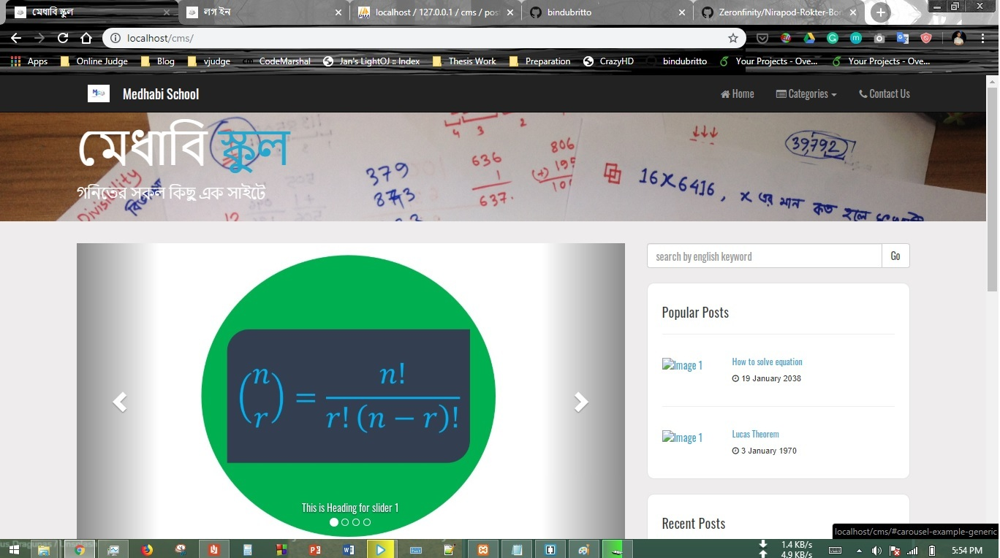
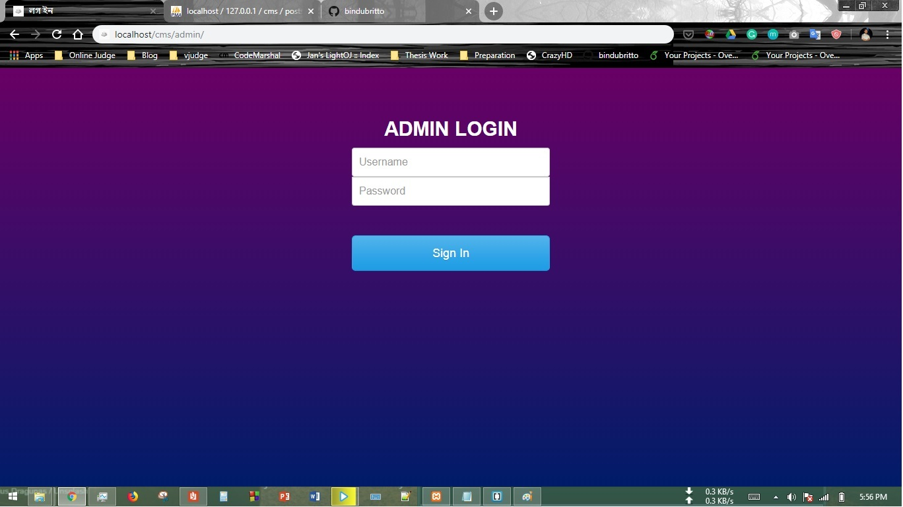
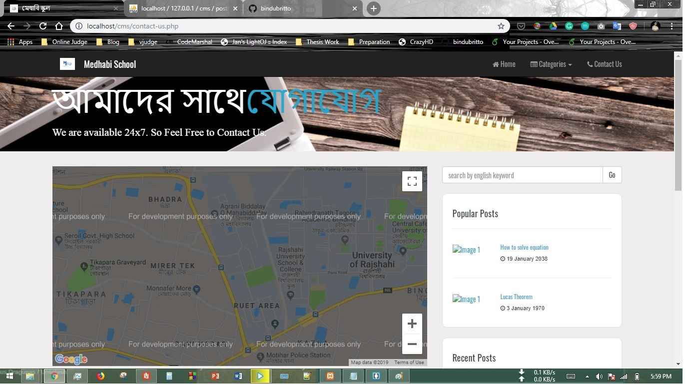

# Medhabi-School-Website
This website was developed for math lover people where people can read math related blog as part of academic course.
   
The database is exported to nirobdb.sql file. The database was handled in XAMPP, where database host is Localhost, username is "root" (without the double quotes) and password is "" i.e. blank.

**Some Screenshots**

Homepage

Admin Login Page

Contact Us page

